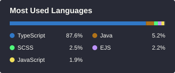

# [Igor Wilian Faoro](https://igorwfaoro.github.io)

📍 Caxias do Sul - RS, Brazil 
💻 Tech Lead & Full-stack Developer 
🤠 Country Music 
🏞️ Outdoor Adventurer

## About Me
I'm a tech lead and full-stack developer focused on building and evolving reliable digital products.

### Find me

 
  
  
  
  
  
  
  

 

  

    
  

  

    
  

## Open source

A few recent merged PRs in projects I've contributed to:

<!-- OPEN_SOURCE_CONTRIBUTIONS_START -->
- [libredb/libredb-studio](https://github.com/libredb/libredb-studio) · [fix(results): fit result grid columns to header content (#1101)](https://github.com/libredb/libredb-studio/pull/1113) · Sep 2026
- [libredb/libredb-studio](https://github.com/libredb/libredb-studio) · [fix(admin): clarify Overview Recent Activity scope](https://github.com/libredb/libredb-studio/pull/1079) · Sep 2026
<!-- OPEN_SOURCE_CONTRIBUTIONS_END -->
